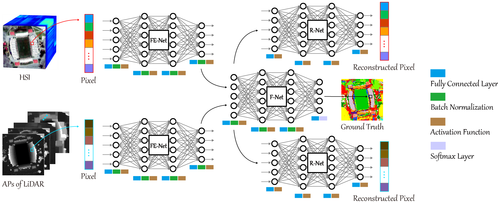

# Deep Encoder-Decoder Networks for Classification of Hyperspectral and LiDAR Data

[Danfeng Hong](https://sites.google.com/view/danfeng-hong), [Lianru Gao](https://scholar.google.com/citations?hl=en&user=f6OnhtcAAAAJ), [Renlong Hang](https://www.researchgate.net/profile/Renlong_Hang2), [Bing Zhang](http://english.radi.cas.cn/Education/PhDS/201401/t20140109_115415.html), [Jocelyn Chanussot](http://jocelyn-chanussot.net/)

___________

The code in this toolbox implements the ["Deep Encoder-Decoder Networks for Classification of Hyperspectral and LiDAR Data"](https://ieeexplore.ieee.org/document/9179756). More specifically, it is detailed as follow.

Citation
---------------------

**Please kindly cite the papers if this code is useful and helpful for your research.**

Danfeng Hong, Lianru Gao, Renlong Hang, Bing Zhang, Jocelyn Chanussot. Deep Encoder-Decoder Networks for Classification of Hyperspectral and LiDAR Data, IEEE Geoscience and Remote Sensing Letters, 2020, DOI: 10.1109/LGRS.2020.3017414.

     @article{hong2020more,
      title     = {Deep Encoder-Decoder Networks for Classification of Hyperspectral and LiDAR Data},
      author    = {D. Hong and L. Gao and R. Hang and B. Zhang and J. Chanussot},
      journal   = {IEEE Geosci. Remote Sens. Lett.}, 
      year      = {2020},
      note      = {DOI:10.1109/LGRS.2020.3017414},
      publisher = {IEEE}
     }

System-specific notes
---------------------
The data were generated by Matlab R2016a or higher versions, and the codes of various networks were tested in Tensorflow 1.14 version in Python 3.7 on Windows 10 machines.

The orginal HS-Lidar data used in this paper can be downloaded from

Google drive: https://drive.google.com/file/d/1UaeUWqTHhXzpwGHZElcF8AHwmVo0IwaV/view?usp=sharing

Baiduyun: https://pan.baidu.com/s/1WI0Gljy0kRcj67dX3xjQUA (access code: 0c6p)

Note: If you would like to use these data, you have to cite the related works, otherwise, you will be trapped into the copyright issues. Please pay more attention to it.

How to use it?
---------------------
Here an example experiment is given by using Houston2013 hyperspectral and LiDAR data. Directly run EndNet.py functions to produce the results. Please note that due to the randomness of the parameter initialization, the experimental results might have slightly different from those reported in the paper. In this toolbox, we fixed the parameter initialization to produce repeatable results.

If you want to run the code in your own data, you can accordingly change the input (e.g., data, labels) and tune the parameters.

If you encounter the bugs while using this code, please do not hesitate to contact us.

Licensing
---------

Copyright (C) 2020 Danfeng Hong

This program is free software: you can redistribute it and/or modify it under the terms of the GNU General Public License as published by the Free Software Foundation, version 3 of the License.

This program is distributed in the hope that it will be useful, but WITHOUT ANY WARRANTY; without even the implied warranty of MERCHANTABILITY or FITNESS FOR A PARTICULAR PURPOSE. See the GNU General Public License for more details.

You should have received a copy of the GNU General Public License along with this program.

Contact Information:
--------------------

Danfeng Hong: hongdanfeng1989@gmail.com 
Danfeng Hong is with the Univ. Grenoble Alpes, CNRS, Grenoble INP, GIPSA-lab, 38000 Grenoble, France.
